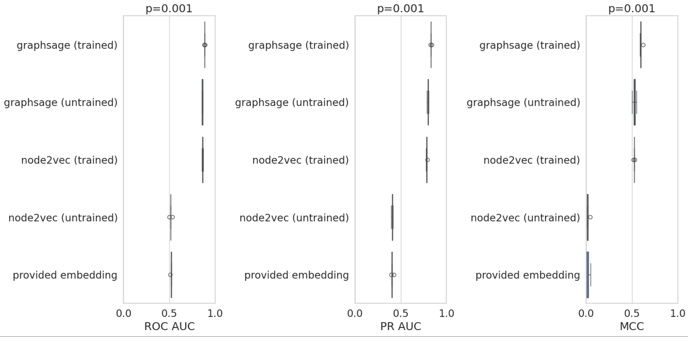

# BioKG

## Overview
- 


## Instructions to reproduce

1. Create local environment
```
micromamba install --name base --file environment.yaml && \
    micromamba clean --all --yes

RUN --mount=type=secret,id=pip,target=/root/.pip/pip.conf \
    micromamba run -n base pip install -r requirements.txt && \
    micromamba run -n base pip install -e biokg
```

2. Copy `Nodes.csv`, `Edges.csv`, `Embeddings.csv` and `Ground Truth.csv` to the `data` directory.

3. Run `jupyter execute notebooks/1_data.ipynb notebooks/2_degree_distribution.ipynb notebooks/3_model.ipynb` to run a simple pipeline. In short we:
- (`notebooks/1_data.ipynb`) Load the raw data and build a tripartite network of disease-molecule-genes, alongside adding NER embeddings from a recent BeRT model.
- (`notebooks/2_degree_distribution.ipynb`) Assess the effect of degree distribution (connectivity) and the prevalence of frequent fliers.
- (`notebooks/3_model.ipynb`) Evaluate two models (Node2Vec, GraphSage) alongside the provided embeddings on simple random splits. We then predict the full 100M disease-molecule matrix to identify highly predicted and enriched novel disease-pairs.

The workflow can also be run using Docker (currently untested):

1. `docker buildx build -t biokg -f Dockerfile .`

2. ```docker run --gpus all -v "$(pwd)":/app/biokg/data biokg jupyter execute notebooks/1_data.ipynb notebooks/2_degree_distribution.ipynb notebooks 3_model.ipynb```

## Future improvements
- Convert to using a (heterogenous GNN)[https://pytorch-geometric.readthedocs.io/en/2.6.0/notes/heterogeneous.html], where indivual nodes and meteaedges have their own encoding. Alternatively, we could use one of the many KGE methods in PyG.
- Add Metapath2VecEmbeddingModel, in which separate embeddings can be encoded with indivual metapaths such as disease<>disease and molecule<>molecule similarity, and disease->gene->molecule pathomechanisms.
- The majority of Molecules where molecules from ChEMBL or ChEBI. Encode their structure by parsing their SMILES and using mol2vec.
- If the end goal is to use this pipeline to repurpose drugs for rare diseases. Using random splits even very simple models perform well. By definition orphan diseases have no treatments, and rare diseases will have few edges in the graph. We can (somewhat) approximate the former using leave-disease-out splits. Our simple embedding and classifier model performs close to random when tasked to generalise to new diseases. Imo, attention should be given to making mechanistic models that function well even in the low-data regime of drug repurposing for rare diseases.

## Random splits


## Leave disease out
